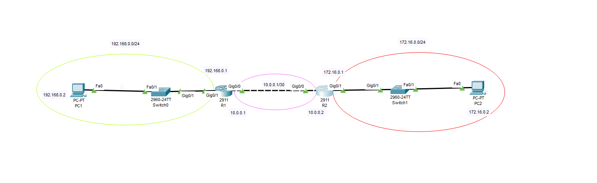

**OSPF**



OSPF (Open Shortest Path First) – Description
English:
OSPF (Open Shortest Path First) is a link-state routing protocol used in IP networks. It dynamically calculates the best path for data packets based on the Dijkstra algorithm and updates the routing table accordingly. OSPF is a widely used interior gateway protocol (IGP) that provides fast convergence and efficient routing.

Key features of OSPF:

Hierarchical structure with areas (e.g., backbone area 0).
Uses cost as a metric, considering bandwidth for path selection.
Neighbor relationships are established via Hello packets.
Link-State Advertisements (LSAs) distribute network topology information.
Supports authentication for security.
Fast convergence and loop-free routing using the SPF algorithm.
German (Deutsch):
OSPF (Open Shortest Path First) ist ein Link-State-Routing-Protokoll, das in IP-Netzwerken verwendet wird. Es berechnet dynamisch den besten Weg für Datenpakete anhand des Dijkstra-Algorithmus und aktualisiert entsprechend die Routing-Tabelle. OSPF ist ein weit verbreitetes Interior Gateway Protocol (IGP), das eine schnelle Konvergenz und effizientes Routing bietet.

### **Comparison: OSPF vs. Other Routing Protocols**  

| Feature         | **OSPF** (Open Shortest Path First) | **RIP** (Routing Information Protocol) | **EIGRP** (Enhanced Interior Gateway Routing Protocol) | **BGP** (Border Gateway Protocol) |
|---------------|------------------------------------|-------------------------------------|-------------------------------------------|--------------------------------|
| **Type**      | Link-State Protocol (IGP)        | Distance-Vector Protocol (IGP)     | Advanced Distance-Vector (IGP)            | Path-Vector Protocol (EGP)    |
| **Algorithm** | Dijkstra's SPF Algorithm         | Bellman-Ford Algorithm            | Diffusing Update Algorithm (DUAL)        | Best Path Selection (attributes-based) |
| **Metric**    | Cost (based on bandwidth)        | Hop Count (max 15)                | Composite (Bandwidth, Delay, Load, Reliability) | Multiple attributes (AS-Path, MED, etc.) |
| **Scalability** | High (supports large networks with areas) | Low (limited hop count) | Medium to High | Very High (used for the internet) |
| **Convergence Speed** | Fast | Slow | Faster than OSPF | Slower than IGPs |
| **Administrative Distance (AD)** | 110 | 120 | 90 (internal), 170 (external) | 20 (external), 200 (internal) |
| **Usage** | Enterprise networks | Small networks | Cisco networks | Internet (ISP-level) |
| **Loop Prevention** | SPF Algorithm | Max hop count (15) | Feasibility Condition & Split Horizon | AS-Path attribute |

👉 **Conclusion:** OSPF is better suited for large enterprise networks due to its hierarchical structure and fast convergence. RIP is outdated and best for very small networks. EIGRP is a solid choice but is Cisco-proprietary. BGP is essential for internet-scale routing.

---

### **OSPF Areas, BDR Router, and "router ospf 1" Command**  

#### **1. OSPF Areas**  
OSPF uses a **hierarchical design** to improve scalability and efficiency.  
- **Backbone Area (Area 0):** The central area that connects all other areas. All OSPF areas must be connected to Area 0.  
- **Regular Areas:** Connected to Area 0 and can contain various routers.  
- **Stub Areas:** Restrict external route advertisements to reduce overhead.  
- **NSSA (Not-So-Stubby Areas):** Similar to stub areas but allow limited external routes.  

#### **2. BDR (Backup Designated Router) in OSPF**  
In multi-access networks (e.g., Ethernet), OSPF uses a **DR/BDR election** to reduce flooding:  
- **DR (Designated Router):** The main router that manages LSAs (Link-State Advertisements).  
- **BDR (Backup Designated Router):** Takes over if the DR fails.  
- **Other routers:** Communicate only with DR/BDR, reducing network overhead.  
- DR/BDR election is based on the highest **OSPF priority** (default: 1) or highest **Router ID** (if priorities are equal).  

#### **3. `router ospf 1` Command in Cisco Configuration**  
This command starts an OSPF process with **Process ID 1**:  
```bash
Router(config)# router ospf 1
```
**Process ID (1 in this case)** is a **local identifier** and does **not** need to match on all routers.  
After entering this mode, you can configure OSPF settings, like:  
  ```bash
  Router(config-router)# network 192.168.1.0 0.0.0.255 area 0
  ```
 This assigns **192.168.1.0/24** to OSPF **Area 0**.  

**Note:** Even though the process ID (e.g., 1) is locally significant, all routers in an OSPF domain must share the same **area structure** to exchange routes properly.


OSPF is a link-state protocol, scalable, and better than RIP for large networks.
It uses areas to optimize routing.
BDR ensures redundancy in multi-access networks.
router ospf 1 starts an OSPF process, and the number (1) is just a local reference.

### **Vergleich: OSPF vs. Andere Routing-Protokolle**  

| Eigenschaft  | **OSPF** (Open Shortest Path First) | **RIP** (Routing Information Protocol) | **EIGRP** (Enhanced Interior Gateway Routing Protocol) | **BGP** (Border Gateway Protocol) |
|-------------|------------------------------------|-------------------------------------|-------------------------------------------|--------------------------------|
| **Typ**      | Link-State-Protokoll (IGP)        | Distanz-Vektor-Protokoll (IGP)     | Erweitertes Distanz-Vektor-Protokoll (IGP) | Pfad-Vektor-Protokoll (EGP) |
| **Algorithmus** | Dijkstra-SPF-Algorithmus       | Bellman-Ford-Algorithmus           | Diffusing Update Algorithm (DUAL)        | Best Path Selection (Attribut-basiert) |
| **Metrik**   | Kosten (basierend auf Bandbreite) | Hop Count (max. 15)                | Kombination aus Bandbreite, Verzögerung, Auslastung, Zuverlässigkeit | Mehrere Attribute (AS-Path, MED usw.) |
| **Skalierbarkeit** | Hoch (unterstützt große Netzwerke mit Areas) | Niedrig (max. 15 Hops) | Mittel bis Hoch | Sehr Hoch (für das Internet) |
| **Konvergenz-Geschwindigkeit** | Schnell | Langsam | Schneller als OSPF | Langsamer als IGPs |
| **Administrative Distance (AD)** | 110 | 120 | 90 (intern), 170 (extern) | 20 (extern), 200 (intern) |
| **Einsatzgebiet** | Unternehmensnetzwerke | Kleine Netzwerke | Cisco-Netzwerke | Internet (ISP-Ebene) |
| **Schleifenvermeidung** | SPF-Algorithmus | Maximale Hop-Zahl (15) | Feasibility Condition & Split Horizon | AS-Path-Attribut |

👉 **Fazit:** OSPF ist ideal für große Unternehmensnetzwerke aufgrund seiner hierarchischen Struktur und schnellen Konvergenz. RIP ist veraltet und nur für sehr kleine Netzwerke geeignet. EIGRP ist eine starke Alternative, aber Cisco-proprietär. BGP ist das Standardprotokoll für Internet-Routing.

---
**Wichtige Merkmale von OSPF:**

Hierarchische Struktur mit Bereichen (z. B. Backbone-Bereich 0).
Verwendet die Metrik „Kosten“, basierend auf der Bandbreite für die Pfadauswahl.
Nachbarschaftsbeziehungen werden durch Hello-Pakete aufgebaut.
Link-State-Advertisements (LSAs) verteilen Informationen über die Netzwerktopologie.
Unterstützt Authentifizierung zur Sicherheit.
Schnelle Konvergenz und schleifenfreies Routing durch den SPF-Algorithmus.
### **OSPF Areas, BDR Router und der Befehl „router ospf 1“**  

#### **1. OSPF Areas (Bereiche)**  
OSPF verwendet eine **hierarchische Struktur**, um Skalierbarkeit und Effizienz zu verbessern.  
- **Backbone Area (Area 0):** Das zentrale Rückgrat, das alle anderen Bereiche verbindet. Alle OSPF-Bereiche müssen mit Area 0 verbunden sein.  
- **Normale Areas:** Sind mit Area 0 verbunden und enthalten verschiedene Router.  
- **Stub Areas:** Begrenzen externe Routen, um den Overhead zu reduzieren.  
- **NSSA (Not-So-Stubby Areas):** Ähnlich wie Stub Areas, aber mit begrenzten externen Routen.  

#### **2. BDR (Backup Designated Router) in OSPF**  
In Multi-Access-Netzwerken (z. B. Ethernet) führt OSPF eine **DR/BDR-Wahl** durch, um die LSA-Flutung zu reduzieren:  
- **DR (Designated Router):** Der Hauptrouter, der LSAs (Link-State Advertisements) verwaltet.  
- **BDR (Backup Designated Router):** Übernimmt die Rolle des DR, falls dieser ausfällt.  
- **Andere Router:** Kommunizieren nur mit DR/BDR, um den Netzwerkverkehr zu minimieren.  
- Die Wahl von DR/BDR basiert auf der höchsten **OSPF-Priorität** (Standardwert: 1) oder der höchsten **Router-ID** (bei gleichen Prioritäten).  

#### **3. `router ospf 1`-Befehl in der Cisco-Konfiguration**  
Dieser Befehl startet einen OSPF-Prozess mit der **Prozess-ID 1**:  
```bash
Router(config)# router ospf 1
```
- **Die Prozess-ID (z. B. 1)** ist eine **lokale Kennung** und muss **nicht** auf allen Routern übereinstimmen.  
- Nach Eingabe dieses Befehls kann OSPF konfiguriert werden, z. B.:  
  ```bash
  Router(config-router)# network 192.168.1.0 0.0.0.255 area 0
  ```
  - Weist das Netzwerk **192.168.1.0/24** dem **Area 0** zu.  

**Wichtig:** Die Prozess-ID (z. B. 1) ist nur lokal bedeutend, aber alle Router im OSPF-Bereich müssen dieselbe **Area-Struktur** haben, um Routen korrekt auszutauschen.

---

**Zusammenfassung:**  
- OSPF ist ein Link-State-Protokoll, skalierbar und besser als RIP für große Netzwerke.  
- Es verwendet **Areas**, um Routing effizient zu gestalten.  
- **BDR** sorgt für Redundanz in Multi-Access-Netzwerken.  
- `router ospf 1` startet einen OSPF-Prozess, wobei die Nummer (1) nur eine lokale Referenz ist.


**Configuration**


**PC1**
```
192.168.0.2 
255.255.255.0
192.168.0.1
```

**PC2**
```
172.16.0.2
255.255.255.0
172.16.0.1
```
**Router0**

```
enable
configure terminal
hostname R1
interface GigabitEthernet0/0
ip address 1.0.0.1 255.255.255.252
no shutdown
exit
interface GigabitEthernet0/0
ip address 10.0.0.1 255.255.255.252
no shutdown
exit
interface GigabitEthernet0/1
ip address 192.168.0.1 255.255.255.0
no shutdown
exit
```

**Router1**

```
enable
configure terminal
hostname R2
interface GigabitEthernet0/0
ip address 10.0.0.2 255.255.255.252
no shutdown
exit
interface GigabitEthernet0/1
ip address 172.16.0.1 255.255.255.0
no shutdown
exit
```

**PC1**, **PC2**

```
Ping
```
```
ping 172.16.0.2

Pinging 172.16.0.2 with 32 bytes of data:

Reply from 192.168.0.1: Destination host unreachable.
Request timed out.
Reply from 192.168.0.1: Destination host unreachable.
Reply from 192.168.0.1: Destination host unreachable.

Ping statistics for 172.16.0.2:
    Packets: Sent = 4, Received = 0, Lost = 4 (100% loss)
```


**OSPF**

**R1**

```
configure terminal
router ospf 1
passive-interface GigabitEthernet0/1
network 192.168.0.0 0.0.0.255 area 1
network 10.0.0.0 0.0.0.3 area 1
exit
exit
```

**R2**
```
router ospf 1
passive-interface GigabitEthernet0/1
network 172.16.0.0 0.0.0.255 area 1
network 10.0.0.0 0.0.0.3 area 1
exit
exit
```
```
R1#show ip ospf database 
            OSPF Router with ID (192.168.0.1) (Process ID 1)

                Router Link States (Area 1)

Link ID         ADV Router      Age         Seq#       Checksum Link count
192.168.0.1     192.168.0.1     449         0x80000003 0x00fbf1 2
172.16.0.1      172.16.0.1      449         0x80000003 0x006a88 2

                Net Link States (Area 1)
Link ID         ADV Router      Age         Seq#       Checksum
10.0.0.1        192.168.0.1     449         0x80000001 0x0081c6
```

```
R2#show ip ospf neighbor 


Neighbor ID     Pri   State           Dead Time   Address         Interface
192.168.0.1       1   FULL/DR         00:00:30    10.0.0.1        GigabitEthernet0/0
```
```
C:\>ping 172.16.0.2

Pinging 172.16.0.2 with 32 bytes of data:

Reply from 172.16.0.2: bytes=32 time<1ms TTL=126
Reply from 172.16.0.2: bytes=32 time<1ms TTL=126
Reply from 172.16.0.2: bytes=32 time<1ms TTL=126
Reply from 172.16.0.2: bytes=32 time=6ms TTL=126

Ping statistics for 172.16.0.2:
    Packets: Sent = 4, Received = 4, Lost = 0 (0% loss),
Approximate round trip times in milli-seconds:
    Minimum = 0ms, Maximum = 6ms, Average = 1ms
```
**Router ID**

**R1**
```
configure terminal
router ospf 1
router-id 1.1.1.1
exit
do clear ip ospf process
exit
copy running-config startup-config
```
```
**R2**
configure terminal
router ospf 1
router-id 2.2.2.2
do clear ip ospf process
exit
exit
copy running-config startup-config
```

**Test**

```
R1#show ip ospf database 
            OSPF Router with ID (1.1.1.1) (Process ID 1)

                Router Link States (Area 1)

Link ID         ADV Router      Age         Seq#       Checksum Link count
2.2.2.2         2.2.2.2         38          0x80000008 0x00ef69 2
192.168.0.1     192.168.0.1     954         0x80000003 0x00fbf1 2
172.16.0.1      172.16.0.1      954         0x80000003 0x006a88 2
1.1.1.1         1.1.1.1         38          0x80000005 0x00793f 2

                Net Link States (Area 1)
Link ID         ADV Router      Age         Seq#       Checksum
10.0.0.1        1.1.1.1         38          0x80000003 0x006bf0
```
```R2#show ip ospf neighbor 


Neighbor ID     Pri   State           Dead Time   Address         Interface
1.1.1.1           1   FULL/DR         00:00:34    10.0.0.1        GigabitEthernet0/0
```

**PC1**
```C:\>ping 172.16.0.2

Pinging 172.16.0.2 with 32 bytes of data:

Reply from 172.16.0.2: bytes=32 time<1ms TTL=126
Reply from 172.16.0.2: bytes=32 time<1ms TTL=126
Reply from 172.16.0.2: bytes=32 time<1ms TTL=126
Reply from 172.16.0.2: bytes=32 time=6ms TTL=126

Ping statistics for 172.16.0.2:
    Packets: Sent = 4, Received = 4, Lost = 0 (0% loss),
Approximate round trip times in milli-seconds:
    Minimum = 0ms, Maximum = 6ms, Average = 1ms
```
